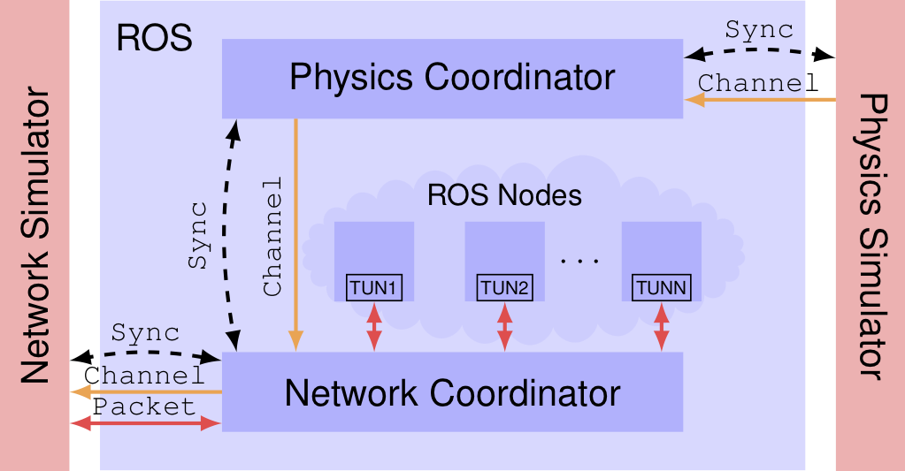

# ROS-NetSim 
### A Framework for the Integration of Robotic and Network Simulators
> Implimentation of [this paper](https://arxiv.org/abs/2101.10113)
<p align="center">
  
</p>

ROS-NetSim is a ROS package that acts as an interface between robotic and network simulators. With ROS-NetSim, we can attain high-fidelity representations of both robotic and network interactions by accurately simulating the Perception-Action-Communication loop. ROS-NetSim is:

* Transparent to the ROS target application
* Agnostic to the specific network and physics simulator being used
* Tunable in fidelity and complexity

## Dependencies
```zsh
pip3 install pyquaternion
```

## Installation

```zsh
# (OPTIONAL)
# mkdir -p ~/catkin_ws/src

# Navigate to catkin your catkin workspace
cd ~/catkin_ws
# Clone project into src
git clone git@github.com:tylerferrara/ros-net-sim.git ./src/ROS-NetSim
# Install dependencies
rosdep install -i --from-path ./src --rosdistro $ROS_DISTRO -y
# Build and install with C++20
catkin_make install --cmake-args -DCMAKE_CXX_STANDARD=20
```

## Testing ROS-NetSim

To test the correct behavior of ROS-NetSim we will run a dummy simulation. The configuration parameters for this example are described in ```example/cfg/example.yaml```. This test simulation uses two dummy simulators, which simply close the synchronization loop. The dummy physics simulator generates random positions for the agents and the dummy network simulator intercepts the packets and delays them for 500ms. 

First, run the dummy network simulator by executing the following command:

```
rosrun example net_sim_dummy.py src/example/cfg/example.yaml 
```

The dummy network simulator will be put on hold until the rest of the components are running. Next, in another terminal, launch the dummy physics simulator (which for this test example, also includes the physics coordinator) by executing the following command:

```
rosrun example phy_sim_dummy.py src/example/cfg/example.yaml 
```

Again, this component will hold until the rest of the simulation is launched. Finally, run the network coordinator by executing the command:

```
rosrun network_coordinator network_coordinator.py src/example/cfg/example.yaml 
```

Note that, since the network coordinator needs to manipulate network interfaces,  it requires root permissions.

As soon as all the components are running, synchronism will start and the physics simulator will start generating arbitrary node positions similar to the following:

```
node_list: 18.195842521106556
node_list: 11.684340332903446
node_list: 2.8332447228696123
node_list: -0.654501732905802
node_list: -0.29849447880207103
node_list: 0.6936700224299548
node_list: 0.03674816634892308
node_list: 4.211485046377071
node_list: 3.1339309588288455
node_list: 8.129863384306084
node_list: 0.43109771468538166
node_list: -0.45313386141764833
node_list: 0.047726476809024414
node_list: -0.7788110473286639
path_details {
  ids: 2
  ids: 1
  los: true
  num_hops: 1
  hop_points: 0.06865299159276339
  hop_points: 0.2702797061757798
  hop_points: 0.7462493334641866
  hop_points: 0.7346620894670425
}
```

These correspond to the the synchronism updates that are shared across the ROS-NetSim components. Furthermore, the network coordinator has created two virtual network interfaces for the IP addresses ```192.168.0.1``` and ```192.168.0.1```, as specified in the configuration file ```example.yaml```. Then, we can test traffic across these IP addresses, for example, by executing a ```ping``` command from one address to the other, i.e., ```ping -I 192.168.0.1 192.168.0.2```. The output should be along the lines of:

```
ping -I 192.168.0.1 192.168.0.2
PING 192.168.0.2 (192.168.0.2) from 192.168.0.1 : 56(84) bytes of data.
64 bytes from 192.168.0.2: icmp_seq=1 ttl=64 time=1005 ms
64 bytes from 192.168.0.2: icmp_seq=2 ttl=64 time=1008 ms
64 bytes from 192.168.0.2: icmp_seq=3 ttl=64 time=1012 ms
^C
--- 192.168.0.2 ping statistics ---
4 packets transmitted, 3 received, 25% packet loss, time 3005ms
rtt min/avg/max/mdev = 1005.133/1008.736/1012.983/3.438 ms, pipe 2
```

You should see that packets are being held for 500ms, resulting in a round trip time of around 1000ms. This means that traffic is being rerouted to the dummy network simulator and ROS-NetSim is operating as intended.
